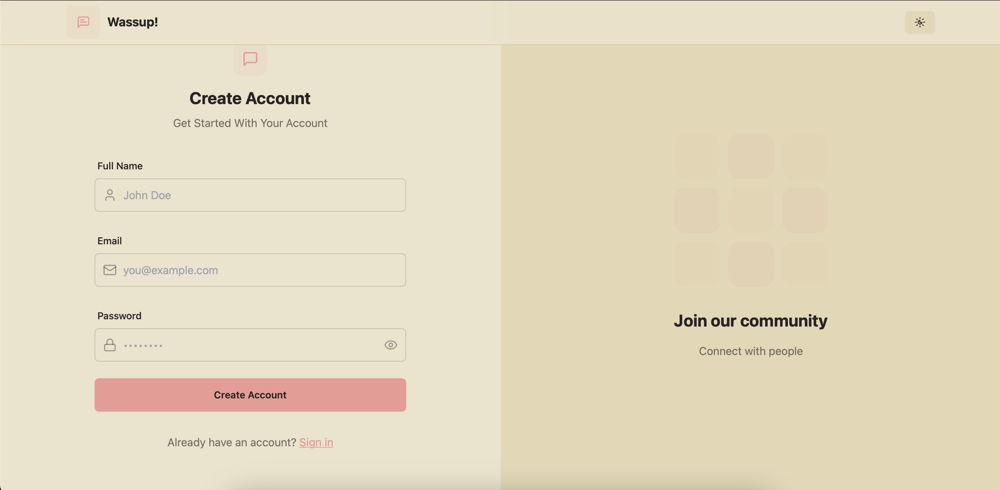

# WhatsApp-like Chat Application

## Overview

This is a real-time chat application built using the **MERN stack (MongoDB, Express.js, React, Node.js)**. It allows users to chat with others in real time using **Socket.io**, manage their profile, add users to their favorites, and check online statuses. The UI is designed with **Tailwind CSS** and **Daisy UI** for a clean and modern experience, while **Zustand** is used for efficient state management.

## Features

-   **Real-time messaging** powered by **Socket.io**
-   **User authentication** (signup, login, logout)
-   **One-on-one private chats**
-   **Online status indicators**
-   **Add users to favorites list**
-   **Update profile picture** (Cloudinary integration)
-   **Delete chats**
-   **Fully responsive UI** with **Tailwind CSS & Daisy UI**
-   **Dark/Light Theme**

## Tech Stack

### Frontend:

-   React.js
-   Zustand (State Management)
-   Tailwind CSS & Daisy UI (Styling)

### Backend:

-   Node.js
-   Express.js
-   MongoDB (Database)
-   Socket.io (Real-time communication)

### Other Integrations:

-   Cloudinary (For profile picture uploads)
-   JWT (Authentication)

## Installation & Setup

### Prerequisites

Ensure you have **Node.js** and **MongoDB** installed on your machine.

### Steps to Run Locally

1. **Clone the Repository**
    ```sh
    git clone https://github.com/gorkeem/mern-chat-app.git
    cd mern-chat-app
    ```
2. **Install Dependencies**
    ```sh
    npm install
    ```
3. **Set Up Environment Variables**
   Create a `.env` file in the backend directory and add the following:
    ```env
    MONGODB_URI=your_mongodb_connection_string
    CLOUDINARY_CLOUD_NAME=your_cloudinary_cloud_name
    CLOUDINARY_API_KEY=your_cloudinary_api_key
    CLOUDINARY_API_SECRET=your_cloudinary_api_secret
    JWT_SECRET=your_jwt_secret
    NODE_ENV=development
    ```
4. **Start the Backend Server**
    ```sh
    cd backend/
    npm run dev
    ```
5. **Start the Frontend**
    ```sh
    cd frontend/
    npm run dev
    ```
6. **Build for Production**
    ```sh
    npm run build
    ```

## Future Enhancements

-   Group chat feature
-   Message reactions
-   Voice & video calling
-   Push notifications

## Screenshots





